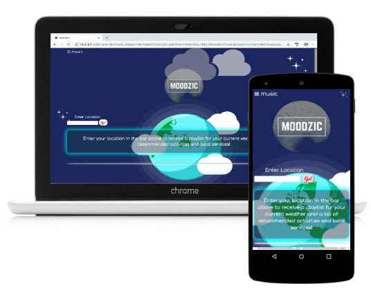

# Moodzic

## Live App:
https://jyin25.github.io/Moodzic/

## About
Moodzic is a weather-based music player app. After logging into Spotify from the splash-screen, the user is presented with the home page where he/she simply puts in their current zip-code or city. Afterwards they are presented with their current weather, a couple of recommended cafes or parks depending on the weather, and of course a specially curated music playlist to go with the user's current weather! Please enjoy our app, happy listening! 

## Technologies Used:
* Javascript
* CSS
* HTML
* JQuery
* API’s used:
  * APIXU - Weather
  * Spotify - Music
  * Yelp - Local Restaurants, Parks

## Usage
> - Download the Repo.
> - Login with your Spotify username and password.
> - Once logged-Search for your location
> - App will generate a music playlist based on the weather
> - App will give you a list of activities to do based on the weather
